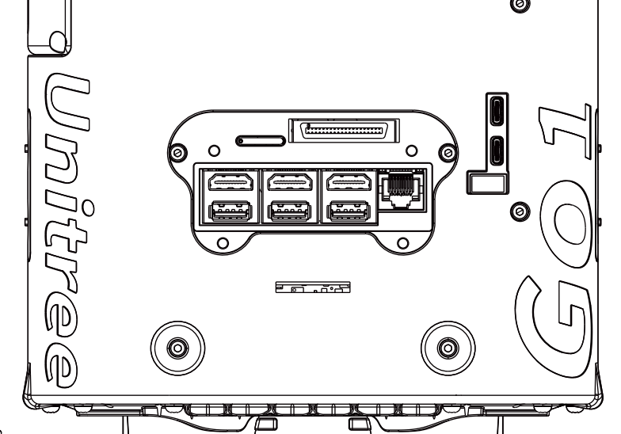

# Deployment

# Step 1: Connect to `go1-nx` via vscode


---

## ToDos

- [ ] get the docker image to work (currently does not run)
  - test if the bare-bone docker image runs. 
  - build within the jetson
- [ ] run the python lcm example, while running the legged sdk example, and print out the message data
- [ ] add the legged SDK here˚
- [ ] add the jetson deployment example here. The deployment repo contain the docker image for deployment, and the python script that runs the LCM publisher with the neural controller.

Need to get everything to run today.

## Guide

**Before deploying, sit the robot down to prone position** by pressing the <kbd>L2</kbd>+<kbd>A</kbd> twice (or until the robot cycles to the state of almost touching the floor), then <kbd>L2</kbd>+<kbd>B</kbd> buttons.

To connect to the Xavier, you have two options: you can either connect directly to the Xavier through HDMI and USB through the middle HDMI/USB ports in the photo below, or connect to the nano (the unitree desktop) through the leftmost HDMI/USB ports in the photo below then run `ssh 192.168.123.15` to get into the Xavier.



From there, the rest of the tutorial is mostly the same.

In one terminal:
```bash
cd /home/unitree/mit/legged-agility_private/go1_gym_deploy/unitree_legged_sdk
./lcm_position
```

In another terminal:
```bash
cd /home/unitree/mit/legged-agility_private/go1_gym_deploy/docker
make run
```
[now you are in the docker container]
```bash
export PYTHONPATH=$PWD
cd go1_gym_deploy/scripts
python deploy_policy.py
```
[you will need to press enter **twice** for the robot to (1) stand up and (2) start the control]

[when the robot stands up after pressing enter the first time, remove all external cables and keep a hand on the robot's handle to avoid damage when the control starts upon pressing enter the second time]


## Previous guide (for when we fix the robot)
Follow the prerequisite networking setup so the Xavier is connected to the internet through the proxy server on the Pi.

**Before deploying, sit the robot down to prone position** by pressing the <kbd>L2</kbd>+<kbd>A</kbd> twice (or until the robot cycles to the state of almost touching the floor), then <kbd>L2</kbd>+<kbd>B</kbd> buttons.

In one terminal:

```bash
ssh go1-nx
cd /home/unitree/mit/legged-agility_private/go1_gym_deploy/unitree_legged_sdk
./lcm_position
```

In another terminal:
```bash
ssh go1-nx
cd /home/unitree/mit/legged-agility_private/go1_gym_deploy/docker
make run
```
[now you are in the docker container]
```bash
export PYTHONPATH=$PWD
cd go1_gym_deploy/scripts
python deploy_policy.py
```
[you will need to press enter **twice** for the robot to (1) stand up and (2) start the control]

[when the robot stands up after pressing enter the first time, remove all external cables and keep a hand on the robot's handle to avoid damage when the control starts upon pressing enter the secnod time]
